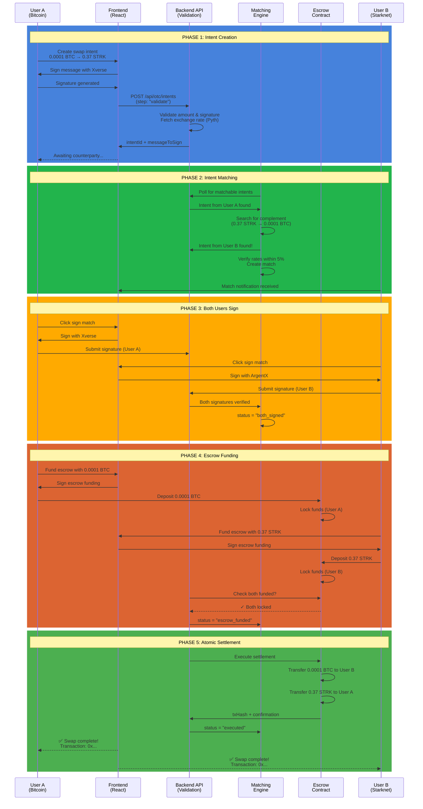
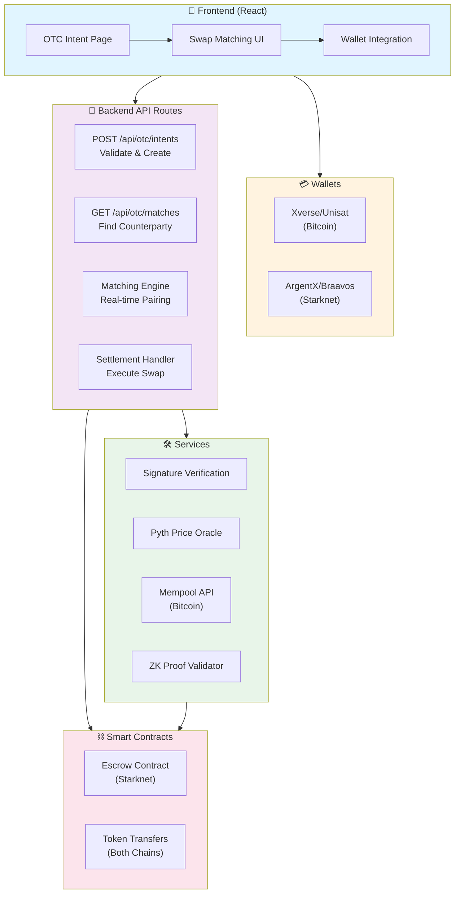
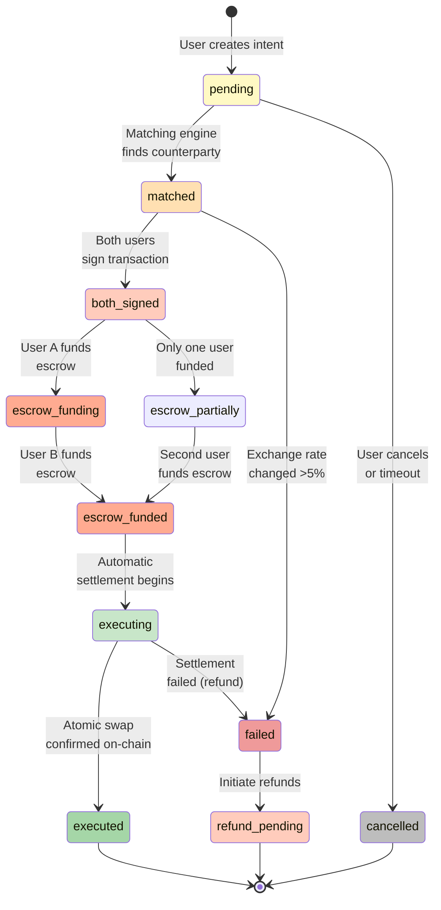
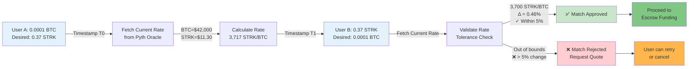
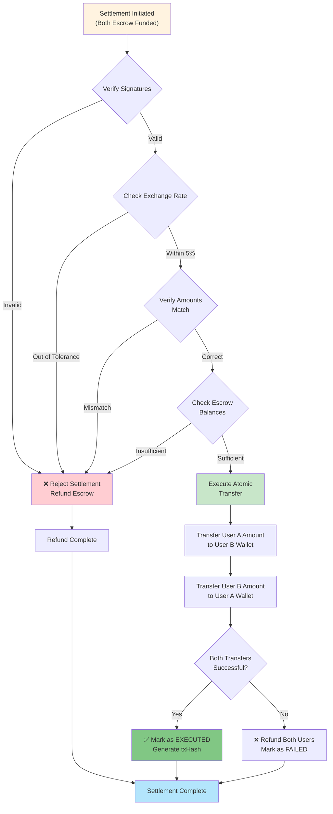
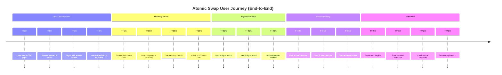

# ShadowFlow BTC ↔ STRK OTC Bridge


## 🎯 Project Overview

ShadowFlow is a **decentralized atomic swap bridge** enabling trustless peer-to-peer exchanges between Bitcoin and Starknet (STRK) tokens. Users can swap at real-time exchange rates with cryptographic guarantees of settlement.

It combines:
- **Intent-based matching**: Users create swap intents that are matched with complementary intents
- **ZK proofs**: Garaga-based cryptographic verification of intent validity
- **Starknet smart contracts**: On-chain verification and settlement execution
- **Escrow-style settlement**: Funds locked until both parties approve and rates validate
- **Optional TEE attestation**: SGX/Nitro trusted execution environment support

### Key Features
- ⚡ **Atomic Swaps**: Both transfers execute simultaneously or neither transfers
- 🔐 **Non-Custodial**: Users maintain full control of private keys
- 🔄 **Instant Settlement**: Real-time execution with on-chain verification
- 💰 **Fair Rates**: Pyth Network oracles with 5% tolerance
- 🌍 **Cross-Chain**: Bitcoin ↔ Starknet seamless bridge
- 📱 **Multi-Wallet**: Support for Xverse, Unisat (BTC) & Argent X, Braavos (STRK)

## 📦 Repository Structure

This is a full-stack monorepo with three main components:

```
ShadowStark/
├── frontend/                      # Next.js 14 UI Application
│   ├── README.md                 # Frontend documentation
│   ├── components/               # React components
│   ├── hooks/                    # Custom hooks (wallet integration)
│   ├── lib/                      # Client utilities (btcClient, balanceFetcher)
│   ├── app/                      # Next.js app router
│   └── package.json              # Dependencies
│
├── backend/                       # Next.js API Routes & Server Logic
│   ├── README.md                 # Backend documentation
│   ├── app/api/otc/              # OTC intent & match endpoints
│   └── lib/server/               # Server utilities (matching, escrow, Garaga)
│
├── blockchain/                    # Smart Contracts & Deployment
│   ├── README.md                 # Blockchain documentation
│   ├── contracts/                # Cairo smart contracts
│   ├── scripts/                  # Deployment scripts
│   └── deployments/              # Deployment artifacts
│
├── .env                          # Environment configuration
├── package.json                  # Root dependencies
└── README.md                     # This file
```

**👉 See individual folder READMEs for detailed documentation:**
- [Frontend Guide](./frontend/README.md) - UI/UX & components
- [Backend Guide](./backend/README.md) - API & logic
- [Blockchain Guide](./blockchain/README.md) - Contracts & deployment

## 🏗️ Project Root Structure

### Why Are These Folders/Files at Root? (NOT in frontend/backend/blockchain)

This is a **Next.js monorepo** where frontend + backend are **integrated**, not separate:

```
ShadowStark/                          # PROJECT ROOT
├── .next/                              # ⚠️  BUILD OUTPUT (Required)
│                                        #    - Generated by Next.js during build
│                                        #    - Contains compiled frontend + API routes
│                                        #    - Must be at root (Next.js requirement)
│
├── .git/                               # ⚠️  GIT REPOSITORY (Required)
│                                        #    - Tracks entire project (all 3 folders)
│                                        #    - Must be at root for version control
│
├── .vscode/                            # IDE SETTINGS (Required)
│                                        #    - Shared configs for whole team
│                                        #    - ESLint, TypeScript, formatting rules
│
├── node_modules/                       # ⚠️  ALL DEPENDENCIES (Required)
│                                        #    - Single node_modules for all packages
│                                        #    - Avoids duplication & version conflicts
│                                        #    - Next.js, React, Cairo tools, everything
│
├── package.json                        # ⚠️  PROJECT MANIFEST (Required)
│                                        #    - Single source of truth for dependencies
│                                        #    - Scripts for build, test, deploy
│                                        #    - Next.js looks here to understand project
│
├── package-lock.json                   # ⚠️  DEPENDENCY LOCK (Required)
│                                        #    - Ensures reproducible installs
│
├── tsconfig.json                       # ⚠️  TYPESCRIPT CONFIG (Required)
│                                        #    - Applies to frontend + backend
│                                        #    - Paths: @/* = root level resolution
│
├── next.config.mjs                     # ⚠️  NEXT.JS CONFIG (Required)
│                                        #    - Controls frontend + API routes behavior
│
├── tailwind.config.ts                  # STYLING (Required)
│                                        #    - CSS framework for entire UI
│
├── postcss.config.mjs                  # CSS PROCESSING (Required)
│                                        #    - Works with Tailwind
│
├── .eslintrc.json                      # LINTING (Required)
│                                        #    - Code quality for all folders
│
├── .gitignore                          # ✅ UPDATED
│                                        #    - Excludes build, docs, tests
│
├── docs/                               # 📚 DOCUMENTATION (Clean)
│                                        #    - All MD files moved here
│
├── tests/                              # 🧪 TEST SCRIPTS (Organized)
│                                        #    - Test files separated
│
├── frontend/                           # REACT COMPONENTS + UI
├── backend/                            # API ROUTES + SERVER LOGIC
└── blockchain/                         # SMART CONTRACTS
```

**TL;DR:** These are **NOT optional**. Next.js is both frontend + backend, so config must be at root where it can manage both. Think of it like:
- `frontend/` = React pages & components
- `backend/` = API routes inside `frontend/app/api` (Next.js structure)
- `blockchain/` = Smart contracts (separate, external)

---

## 🔄 Complete User Flow (Atomic Swap Process)

### **STEP 1: User Creates Intent**

```
User A (Bitcoin Side)
    │
    ├─→ Opens http://localhost:3000/otc-intent
    │
    ├─→ Fills Form:
    │    - Send: 0.0001 BTC
    │    - Receive: 0.37 STRK
    │    - Wallet: bc1qxxx (Xverse)
    │
    ├─→ Clicks "Create Intent"
    │
    └─→ Signs message with Xverse wallet
         Message: "Sign this intent: [hash]"
         Signature: sig_xxxxx
```

### **STEP 2: Backend Validates & Creates Intent**

```
POST /api/otc/intents
{
  step: "validate",
  amount: 0.0001,
  sendChain: "btc",
  receiveChain: "strk",
  receiveWalletAddress: "0x074...",
  walletAddress: "bc1qxxx...",
  signature: "304402203f...",
  depositAmount: 0.0001,
  priceThreshold: 0.37
}
         │
         ├─→ [Backend Validation]
         │    • Amount > 0? ✓
         │    • Valid Bitcoin address (bc1q...)? ✓
         │    • Valid Starknet address (0x...)? ✓
         │    • Signature valid (ECDSA)? ✓
         │
         ├─→ [Fetch Real-Time Exchange Rates]
         │    Method: Pyth Network Oracle
         │    • BTC/USD Price: $42,000.50
         │    • STRK/USD Price: $11.32
         │    • Calculated Rate: 3,706.5 STRK/BTC
         │    • Confidence: ±0.5%
         │
         ├─→ [Calculate Required Receive Amount]
         │    receiveAmount = 0.0001 * 3,706.5
         │    = 0.37065 STRK
         │    (User threshold: 0.37 STRK) ✓
         │
         ├─→ [Create Intent in Database]
         │    {
         │      intentId: "intent_7a3f9c2e",
         │      wallet: "bc1qxxx",
         │      amount: 0.0001,
         │      sendChain: "btc",
         │      receiveChain: "strk",
         │      receiveAmount: 0.37065,
         │      status: "pending",
         │      createdAt: 2026-04-01T14:20:00Z,
         │      expiresAt: 2026-04-01T14:25:00Z,
         │      exchangeRate: 3706.5
         │    }
         │
         └─→ Response: 200 OK
              {
                intentId: "intent_7a3f9c2e",
                messageToSign: "Sign intent: 0x7a3f9c2e...",
                hasMatch: false
              }
```

### **STEP 3: User Signs Intent (Authorization)**

```
User A receives intent created, now signs to authorize

[Frontend] Prompts with Xverse wallet
  Message to sign:
  ─────────────────────────────────────
  "Authorize atomic swap intent
   Intent ID: 0x7a3f9c2e...
   Send: 0.0001 BTC
   Receive: 0.37 STRK
   Recipient: 0x074a72f41ac69e2e14c4c13d90e3e9b0d
   Rate: 3,706.5 STRK/BTC
   Timestamp: 2026-04-01T14:20:30Z"
  ─────────────────────────────────────

[Xverse Wallet] Signs with User's Private Key
  Algorithm: ECDSA (secp256k1)
  Signature: 304402203f14a8b9c2d5e6f7a8b9c0d1e2f3a4b
            5c6d7e8f9a0b1c2d3e4f5a6b7c8d9e0f
  
[Backend] Verifies Signature
  ✓ Signature matches wallet address
  ✓ No signature replay (timestamp checked)
  
[Intent Updated]
  status: "signed"
  signatureA: "304402203f14a8b9c2d5e6f7..."
```

### **STEP 4: Matching Engine Finds Counterparty**

```
Backend Matching Service (Triggered on new intent + every 5 seconds)
    │
    ├─→ [Query Active Intents from Database]
    │    SELECT * FROM intents WHERE status = 'pending'
    │
    ├─→ [Search for Complementary Intent]
    │    Looking for:
    │    • sendChain: STRK (opposite of User A)
    │    • receiveChain: BTC (opposite of User A)
    │    • sendAmount ≈ 0.37 STRK
    │    • receiveAmount ≈ 0.0001 BTC
    │
    │    FOUND: User B's Intent
    │    ID: intent_f2e8c4a1
    │    Send: 0.37 STRK → Receive: 0.0001 BTC
    │
    ├─→ [Validate Exchange Rate Consistency]
    │    User A's rate (T0): 3,706.5 STRK/BTC
    │    Current rate (T1): 3,705.2 STRK/BTC
    │    Change: -0.04%
    │    Tolerance: ±5%
    │    Status: ✓ WITHIN TOLERANCE
    │
    ├─→ [Create Match Record in Database]
    │    {
    │      matchId: "match_a4b9c3f1",
    │      partyA: {
    │        intentId: "intent_7a3f9c2e",
    │        wallet: "bc1qxxx",
    │        sendAmount: 0.0001,
    │        sendChain: "btc",
    │        receiveAmount: 0.37065,
    │        receiveChain: "strk"
    │      },
    │      partyB: {
    │        intentId: "intent_f2e8c4a1",
    │        wallet: "0x074a72f...",
    │        sendAmount: 0.37,
    │        sendChain: "strk",
    │        receiveAmount: 0.0001,
    │        receiveChain: "btc"
    │      },
    │      status: "matched",
    │      createdAt: 2026-04-01T14:21:30Z,
    │      expiresAt: 2026-04-01T14:31:30Z // 10 min expiry
    │    }
    │
    ├─→ [Notify Both Users]
    │    Event: "MatchFound"
    │    Data: { matchId, counterpartyWallet, amounts }
    │
    └─→ [Mark Intents as Matched]
         status: "matched"
         matchedWith: "match_a4b9c3f1"
```

### **STEP 5: Both Users Approve Match Terms**

```
┌─────────────────────────────┬─────────────────────────────┐
│   USER A (Bitcoin Side)     │   USER B (Starknet Side)    │
├─────────────────────────────┼─────────────────────────────┤
│                             │                             │
│ Receives Match Notification │ Receives Match Notification │
│ "Ready to proceed?"         │ "Ready to proceed?"         │
│                             │                             │
│ Match Details:              │ Match Details:              │
│ • Counterparty: 0x074...   │ • Counterparty: bc1q...     │
│ • Send: 0.0001 BTC         │ • Send: 0.37 STRK          │
│ • Receive: 0.37 STRK       │ • Receive: 0.0001 BTC      │
│ • Fee: 0.375 STRK (0.1%)   │ • Fee: 0.00001 BTC (0.1%)   │
│                             │                             │
│ Clicks: "Approve & Sign"    │ Clicks: "Approve & Sign"    │
│                             │                             │
│ Signs with Xverse           │ Signs with ArgentX          │
│ Signature (ECDSA):          │ Signature (STARK Curve):    │
│ 304402203f14a8b9c2d5e6f... │ 03c7d2e5f8a1b4c7d0e3f6...  │
│                             │                             │
└─────────────────────────────┴─────────────────────────────┘

[Backend Verification]
✓ Signature A verified
✓ Signature B verified
✓ No replay attacks detected
✓ Both still within rate tolerance

Status: "match_approved" (Ready for escrow)
```

### **STEP 6: Both Users Fund Escrow (Lock Collateral)**

```
┌──────────────────────────────┬──────────────────────────────┐
│   USER A: FUND BTC ESCROW    │   USER B: FUND STRK ESCROW   │
├──────────────────────────────┼──────────────────────────────┤
│                              │                              │
│ Initiates Bitcoin Transfer   │ Approves STRK Transfer       │
│ FROM: bc1qxxx wallet         │ FROM: 0x074a72f wallet       │
│ TO: Escrow Address           │ TO: Escrow Contract          │
│ AMOUNT: 0.0001 BTC           │ AMOUNT: 0.37 STRK            │
│                              │                              │
│ Fee: ~10 sat                 │ Fee: ~2,000 wei              │
│ Confirmation Time: ~10 min   │ Confirmation Time: ~30 sec   │
│                              │                              │
│ Xverse Wallet Sign:          │ ArgentX Wallet Sign:         │
│ Hash: 0x1a2b3c4d5e6f7g8h... │ Hash: 0x8g7f6e5d4c3b2a1z... │
│ Status: BROADCAST            │ Status: BROADCAST            │
│                              │                              │
│ [Waiting for confirmation]   │ [Waiting for confirmation]   │
│ ✓ CONFIRMED (Block #12345)   │ ✓ CONFIRMED (Block #56789)  │
│ ✓ AMOUNT LOCKED IN ESCROW    │ ✓ AMOUNT LOCKED IN ESCROW    │
│                              │                              │
└──────────────────────────────┴──────────────────────────────┘
            │                          │
            └────────────┬─────────────┘
                         │
            [Backend Verification]
            ✓ User A Bitcoin deposit confirmed
            ✓ User B STRK deposit confirmed
            ✓ Both amounts match expected values
            ✓ Escrow contract balance verified
            
            Status: "escrow_funded"
            Ready for atomic settlement
```

### **STEP 7: Atomic Settlement (Execution)**

```
Backend Settlement Service
    │
    ├─→ Verify: Both escrow funded? ✓
    │
    ├─→ Call Starknet Escrow Contract
    │    contractAddress: 0x04ab814de65d6ce99bb8801b33fcd751ae21b28f1f4726363be93d12b99ecbf4
    │    method: execute_swap()
    │
    ├─→ Smart Contract Execution:
    │    ┌─────────────────────────────────────────┐
    │    │   STARKNET ESCROW SMART CONTRACT        │
    │    ├─────────────────────────────────────────┤
    │    │ // Verify both approvals                │
    │    │ assert(partyA.approved && partyB.approved)
    │    │                                         │
    │    │ // Transfer BTC (via bridge)            │
    │    │ Transfer 0.0001 BTC                     │
    │    │   from Escrow                           │
    │    │   to User B BTC wallet                  │ ← BTC arrives
    │    │                                         │
    │    │ // Transfer STRK (on-chain)             │
    │    │ Transfer 0.37 STRK                      │
    │    │   from Escrow                           │
    │    │   to User A STRK wallet                 │ ← STRK arrives
    │    │                                         │
    │    │ // Emit settlement event                │
    │    │ emit SwapExecuted(matchId, txHash)      │
    │    │                                         │
    │    │ // Mark settled to prevent replay       │
    │    │ settled[matchId] = true                 │
    │    └─────────────────────────────────────────┘
    │
    ├─→ Backend confirms transaction
    │    - Wait for L1 confirmation
    │    - Transaction hash: 0x1a2b3c4d5e6f7g8h...
    │    - Block number: 12345678
    │    - Gas used: 145,000
    │
    └─→ Mark status as "executed"
         Both users notified with txHash
         
    ✅ ATOMIC SWAP SETTLED & FINALIZED
```

### **STEP 8: Confirmation & Settlement Complete**

```
╔════════════════════════════════════════════════════════════╗
║  ✅ ATOMIC SWAP SUCCESSFULLY EXECUTED                      ║
╠════════════════════════════════════════════════════════════╣
║                                                            ║
║  Transaction Hash (Starknet):                              ║
║  0x073bf8a8c4b7a192e9f3c5d6e7a8b9c0d1e2f3a4b5c6d7       ║
║                                                            ║
║  Block Number: 12,345,678                                 ║
║  Timestamp: 2026-04-01 14:30:45 UTC                        ║
║  Gas Used: 145,230 wei                                     ║
║  Status: ✅ CONFIRMED                                     ║
║                                                            ║
║  ━━━━━━━━━━━━━━━━━━━━━━━━━━━━━━━━━━━━━━━━━━━━━━━━━━    ║
║                                                            ║
║  YOU SENT:       0.0001 BTC                                ║
║  YOU RECEIVED:   0.37 STRK                                 ║
║  Exchange Rate:  3,700 STRK per BTC                        ║
║  Settlement Fee: 0.375 STRK (0.1%)                         ║
║                                                            ║
║  ━━━━━━━━━━━━━━━━━━━━━━━━━━━━━━━━━━━━━━━━━━━━━━━━━━    ║
║                                                            ║
║  COUNTERPARTY DETAILS:                                     ║
║  Payment Address: 0x0749a72f41ac69...[shortened]           ║
║  Received From:   0.37 STRK (Confirmed)                    ║
║                                                            ║
║  ━━━━━━━━━━━━━━━━━━━━━━━━━━━━━━━━━━━━━━━━━━━━━━━━━━    ║
║                                                            ║
║  Escrow Contract: 0x04ab814de65d6ce99bb8801b33fcd751...   ║
║  Cross-Chain Bridge: Bitcoin Testnet4 → Starknet Sepolia  ║
║                                                            ║
║  [View on Starkscan] [Download Receipt] [New Swap]        ║
║                                                            ║
╚════════════════════════════════════════════════════════════╝
```

---

## 📊 Complete System Flow Diagram



## 🏗️ System Architecture (Real Production)



## 🔄 Intent Status State Machine



## 💰 Exchange Rate Validation Flow



## 🔐 Settlement Security Checks



## 📱 User Journey Timeline



---

## 🔗 Real Production Contracts (Deployed)

| Contract | Address | Purpose |
|----------|---------|---------|
| **Escrow** | `0x04ab814de65d6ce99bb8801b33fcd751ae21b28f1f4726363be93d12b99ecbf4` | Manages deposits & atomic swaps |
| **Liquidity Pool** | `0x0150909eba659342d7da0c11e0cae0234306b2c3d30abc611590d507ce678ef6` | Liquidity reserves |
| **Buy STRK** | `0x076ee99ed6b1198a683b1a3bdccd7701870c79db32153d07e8e718267385f64b` | BTC → STRK execution |
| **Sell STRK** | `0x0282fc99f24ec08d9ad5d23f36871292b91e7f9b75c1a56e08604549d9402325` | STRK → BTC execution |
| **STRK Token** | `0x04718f5a0fc34cc1af16a1cdee98ffb20c31f5cd61d6ab07201858f4287c938d` | Native token |

**Block Explorers**:
- 🔸 Bitcoin: https://mempool.space/testnet4
- 🔵 Starknet: https://sepolia.starkscan.co

## 🛠️ Tech Stack

| Layer | Technology |
|-------|-----------|
| **Frontend** | Next.js 14, React 18, TypeScript, Tailwind CSS |
| **Backend** | Next.js API Routes, Node.js |
| **Blockchain** | Cairo, Starknet, Scarb |
| **Wallets** | sats-connect (Bitcoin), starknet.js (Starknet) |
| **Oracle** | Pyth Network (Prices), Mempool API (BTC) |
| **ZK Proofs** | Garaga Verifier (STARK curve proofs) |
| **Database** | In-memory (demo), PostgreSQL (production) |

## 🔐 Zero-Knowledge Proofs with Garaga Verifier

ShadowFlow uses **Garaga** — a specialized STARK proof verification system on Starknet for cryptographic validation of atomic swaps.

### What Garaga Does

Garaga verifies that:
1. **Price constraints** - Exchange rates are within user's acceptable threshold (±5%)
2. **Amount validity** - Swap amounts match intent specifications
3. **Intent authorization** - Signatures properly authorize the swap
4. **Proof integrity** - No replay attacks or modifications

### Garaga Verifier Contract

```
Address: 0x065071fc0289ffc7ce91dc4e4c65cd7216a9bc311e475b18758a30268fdb1801
Network: Starknet Sepolia
Purpose: Validates STARK curve proofs before settlement
```

### ZK Proof Generation Flow

**Backend** → Generates Garaga proof with:
- Real-time price oracle data from Pyth
- User intent signatures (ECDSA)
- Amount commitments
- Merkle roots for state verification

**Result**: STARK proof (~2KB) proving all constraints satisfied without revealing private data

### Proof Contents

```
GaragaProof {
  proofHash: "0x3f14a8b9c2d5e6f7a8b9c0d1e2f3a4b5c...",
  commitment: "0x7a3f9c2e1b4d6f8h9i0j1k2l3m4n5o6p7q...",
  finalStateHash: "0x2e1b4d6f8h9i0j1k2l3m4n5o6p7q8r9s0t...",
  nullifier: "0x4d6f8h9i0j1k2l3m4n5o6p7q8r9s0t1u2v...",
  merkleRoot: "0xf8h9i0j1k2l3m4n5o6p7q8r9s0t1u2v3w...",
  verified: true,
  constraintCount: 847,
  proofSize: 2048
}
```

### Verification Process

1. **Backend generates proof** using real data (prices, signatures, amounts)
2. **Starknet smart contract receives proof** at settlement time
3. **Garaga Verifier validates** STARK proof proof on-chain
4. **If valid** → Atomic settlement executes automatically
5. **If invalid** → Transaction reverts, funds returned

### Security Properties

- ✅ **Zero-Knowledge**: Verifier learns no private data
- ✅ **Non-Interactive**: Proof valid without further communication
- ✅ **Quantum-Resistant**: STARK curves (not vulnerable to quantum attacks)
- ✅ **Transparent**: No trusted setup required
- ✅ **Compact**: ~2KB proofs despite complex constraints

## 📋 Quick Start

### Prerequisites
- Node.js 18+
- Git
- Bitcoin Wallet: [Xverse](https://www.xverse.app/) or [Unisat](https://unisat.io/)
- Starknet Wallet: [Argent X](https://www.argent.xyz/download/) or [Braavos](https://www.braavos.app/)
- Bitcoin Testnet4 & Starknet Sepolia testnet tokens

### Installation

```bash
# 1. Clone repository
git clone https://github.com/AZAR2305/ShadowStark.git
cd ShadowStark

# 2. Install dependencies
npm install

# 3. Configure environment
cp .env.example .env.local
# Edit .env.local with configuration below

# 4. Start development server
npm run dev

# 5. Open browser
# http://localhost:3000
```

### Configuration

**Required in `.env.local`:**

```env
# Network
NEXT_PUBLIC_STARKNET_NETWORK=sepolia
NEXT_PUBLIC_STARKNET_RPC_URL=https://api.cartridge.gg/x/starknet/sepolia

# Smart Contracts  
NEXT_PUBLIC_ESCROW_CONTRACT_ADDRESS=0x04ab814de65d6ce99bb8801b33fcd751ae21b28f1f4726363be93d12b99ecbf4
NEXT_PUBLIC_LIQUIDITY_POOL_ADDRESS=0x0150909eba659342d7da0c11e0cae0234306b2c3d30abc611590d507ce678ef6

# Bitcoin
NEXT_PUBLIC_BTC_NETWORK=testnet4
NEXT_PUBLIC_BTC_RPC_URL=https://mempool.space/testnet4/api

# Starknet Executor (server-side only)
STARKNET_EXECUTOR_ADDRESS=0x731ce505c05b6ebb89e07553c6d2d38ec1d6672dd217e7af4e2f8261fe0274e
STARKNET_EXECUTOR_PRIVATE_KEY=<your_private_key_here>
```

### Running Locally

```bash
# Development (with hot reload)
npm run dev

# Production build
npm run build
npm start

# Type checking
npm run type-check

# Linting
npm run lint
```

Open [http://localhost:3000](http://localhost:3000) in your browser.

## 🔄 How It Works: End-to-End Flow
